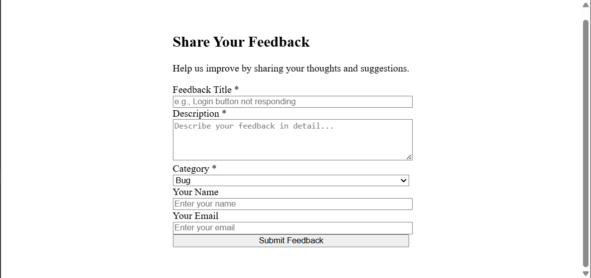
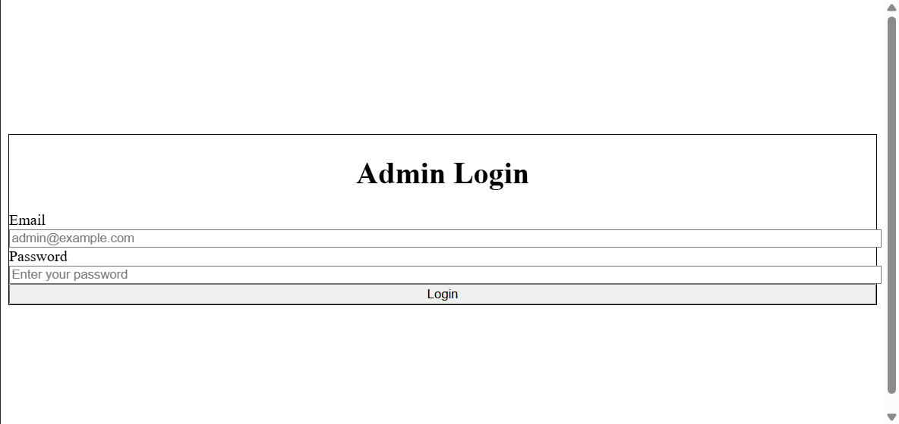
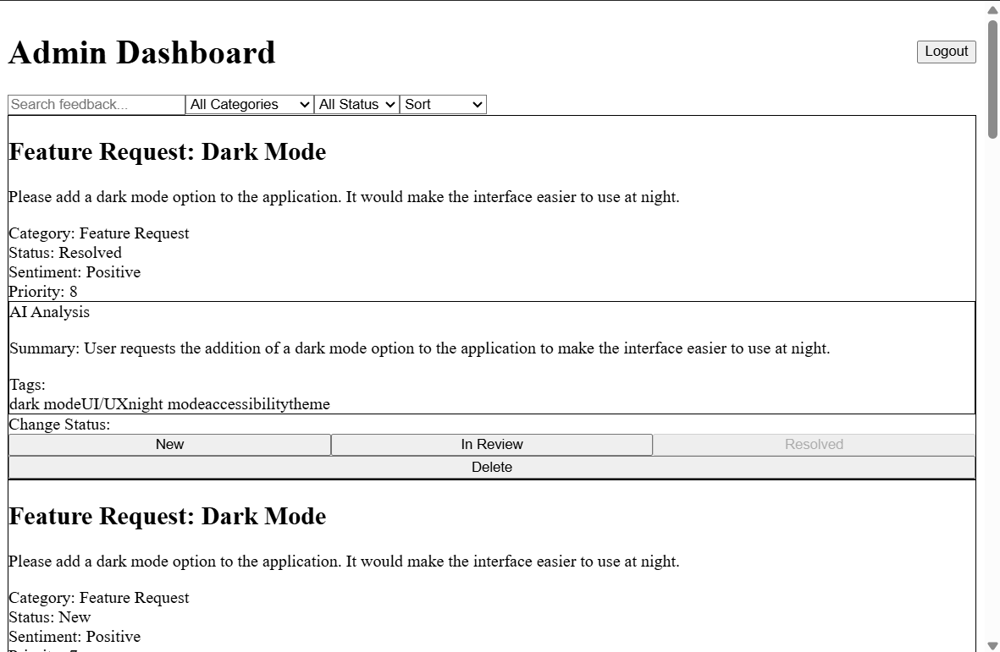

FeedPulse is an AI-powered product feedback platform that lets users submit feedback and allows admins to review, filter, and analyse it.
To build a backend using Google Gemini to extract insights from feedback. To build a frontend using NextJS

### Tech Stack
- **Frontend**: Next.js 14 (App Router), React 18, Tailwind CSS 4, TypeScript
- **Backend**: Node.js, Express, TypeScript
- **Database**: MongoDB (via Mongoose)
- **AI**: `@google/generative-ai` (Google Gemini)

### Run the project locally
#### 1. Prerequisites

- **Node.js** 18+ and npm
- **MongoDB** instance (local or cloud, e.g. Atlas)

#### 2. Clone the repository

```bash
git clone <your-repo-url>
cd FeedPulse
```

#### 3. Backend setup

```bash
cd backend
npm install
```

Create a `.env` file in the `backend` folder:

```bash
PORT=5000
MONGO_DB_URL=mongodb://localhost:27017/feedpulse
CLIENT_URL=http://localhost:3000
ADMIN_EMAIL=admin@example.com
ADMIN_PASSWORD=your-strong-password
JWT_SECRET_KEY=your-jwt-secret
GEMINI_API_KEY=your-gemini-api-key
```

Then start the backend:

```bash
npm run dev
```

The API will be available at `http://localhost:5000/api`.

#### 4. Frontend setup

In another terminal:

```bash
cd frontend
npm install
npm run dev
```

The app will be available at `http://localhost:3000`.

Ensure `frontend/lib/api.ts` points to your backend URL (by default `http://localhost:5000/api`).

---

### Environment variables (backend)

All environment variables are loaded in `backend/src/config/env.ts`:

- **PORT**: Port where the Express server runs (default `5000`).
- **MONGO_DB_URL**: MongoDB connection string.
- **CLIENT_URL**: URL of the frontend (used for CORS, e.g. `http://localhost:3000`).
- **ADMIN_EMAIL**: Initial admin email used for login.
- **ADMIN_PASSWORD**: Initial admin password used for login.
- **JWT_SECRET_KEY**: Secret used to sign JWT tokens (required).
- **GEMINI_API_KEY**: Google Gemini API key for AI features (required).
- 
### Screenshots
**Home page**
  ```md
  
  ```
**Feedback Form**
  ```md
  
  ```
**Admin Login**
  ```md
  
  ```
**Admin Dashboard**
  ```md
  
  ```
**Future implements**
- Create a completed authentication system with proper user management

**Bug**
Tailwind CSS is not configured properly. So, styles did not appear in the frontend


